# Social-Network-API

## URL
N/A

## Description

This project is a social network API that uses a NoSQL database.
The project will start the server and sync the Mongoose models to the MongoDB database.
The project will allow data for the GET, POST, PUT, & DELETE routes will be displayed using Insomnia for the following:
    Users
    Thoughts
    Reactions to thoughts
    Friends

## Summary

```
GIVEN a social network API
WHEN I enter the command to invoke the application
THEN my server is started and the Mongoose models are synced to the MongoDB database
WHEN I open API GET routes in Insomnia for users and thoughts
THEN the data for each of these routes is displayed in a formatted JSON
WHEN I test API POST, PUT, and DELETE routes in Insomnia
THEN I am able to successfully create, update, and delete users and thoughts in my database
WHEN I test API POST and DELETE routes in Insomnia
THEN I am able to successfully create and delete reactions to thoughts and add and remove friends to a user’s friend list
```

## Installation

npm init -y
npm start

## Usage

This is a social network API that uses a NoSQL database.

[Social-Network-API-Walk-Through](https://github.com/NewguyenGitHub/Social-Network-API/assets/118239578/3b43d58b-1624-4867-83b8-66bcf9825b47)

### Social-Network-API-User-Routes
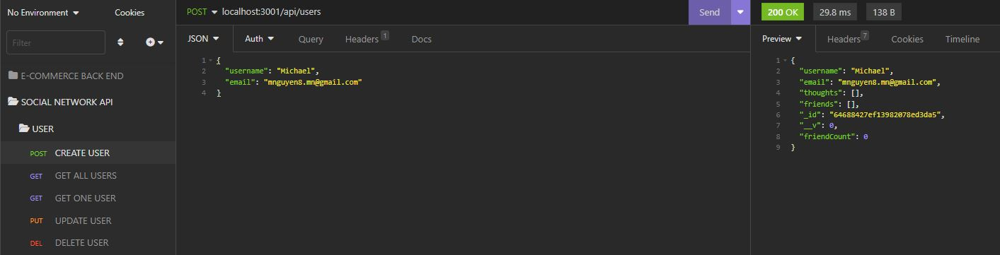
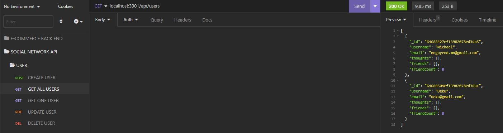
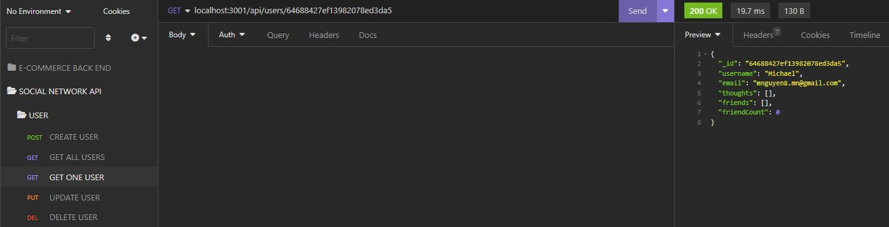
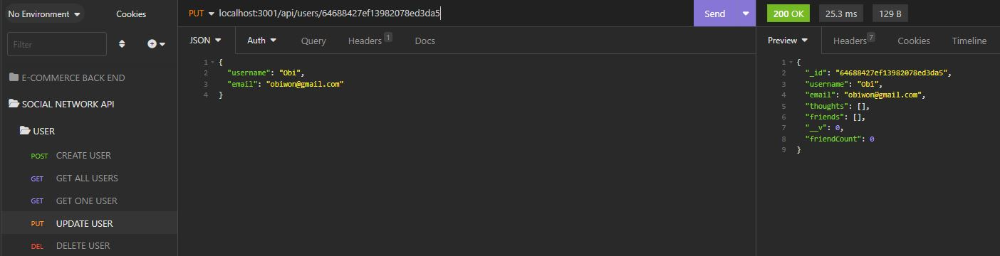
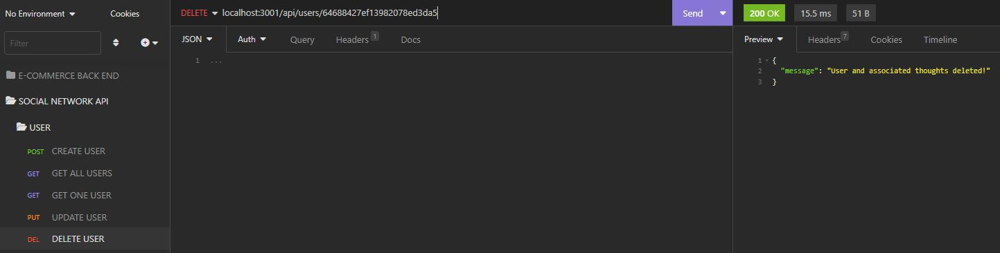

### Social-Network-API-Thought-Routes
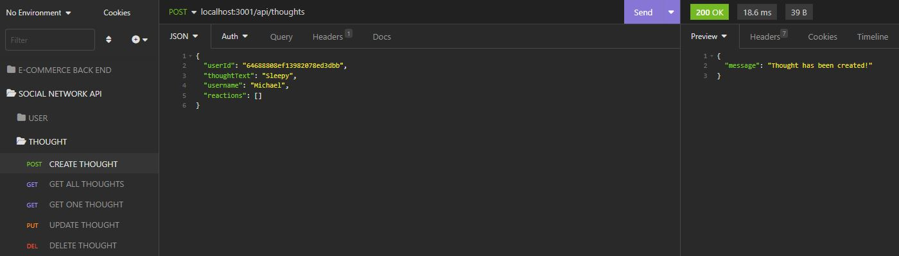
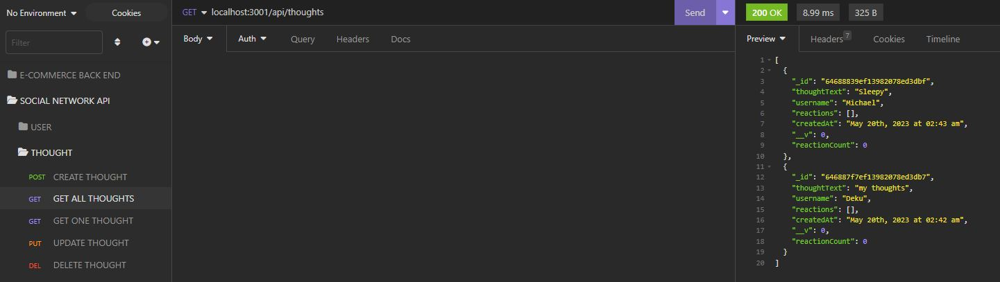
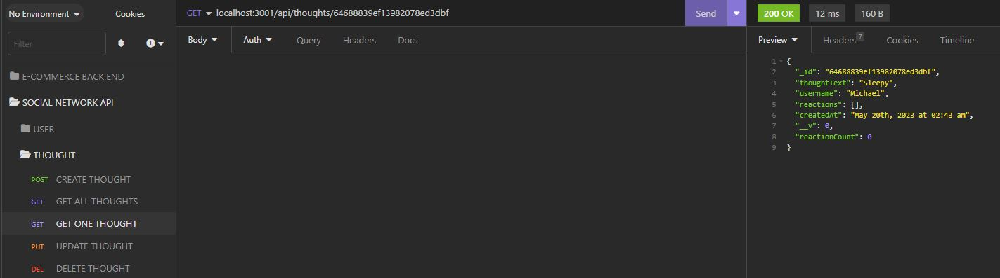
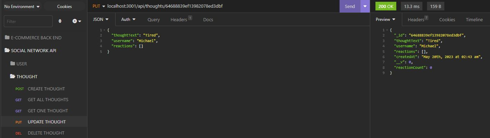
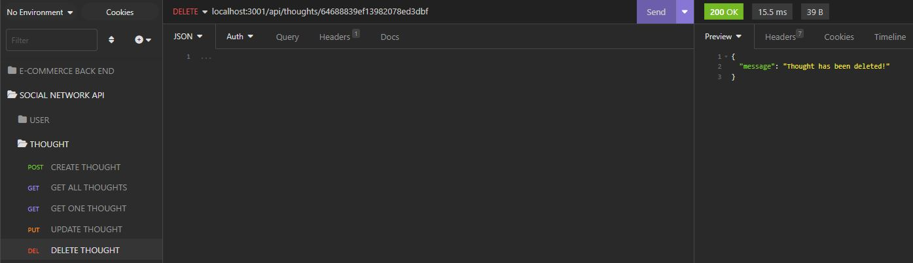

### Social-Network-API-Reactions-Routes
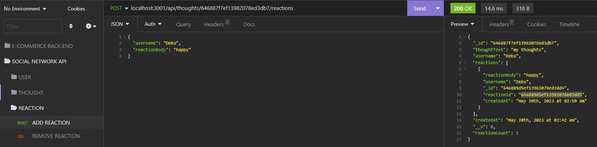
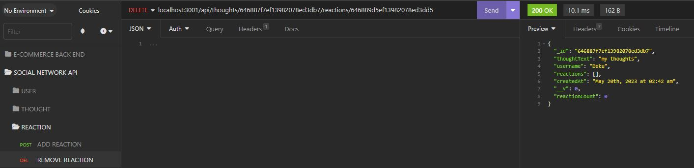

### Social-Network-API-Friends-Routes
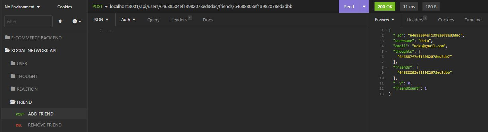
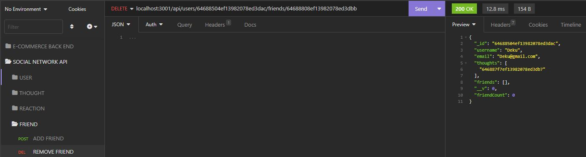

## Credits

N/A

## License

Please refer to the LICENSE in the repo.
